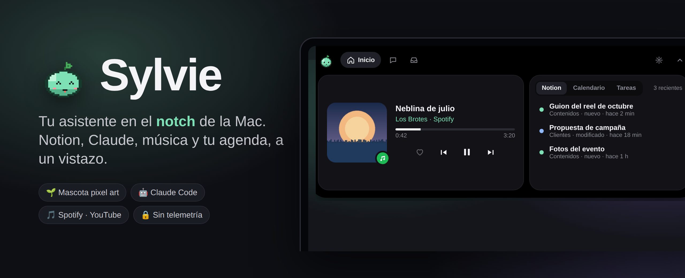
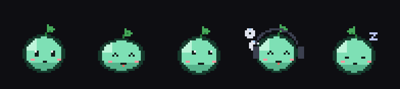
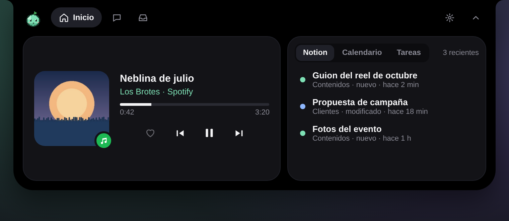
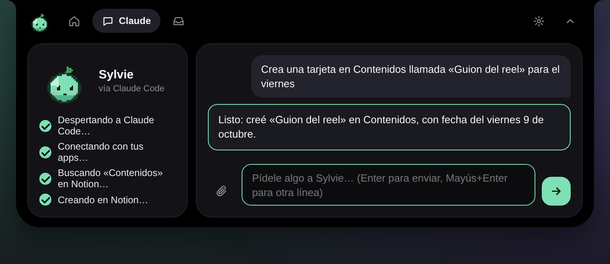
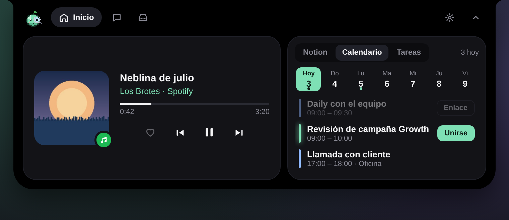
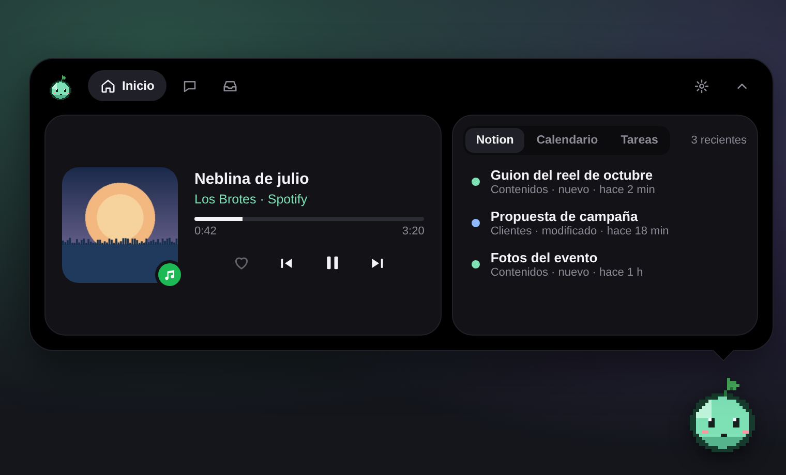
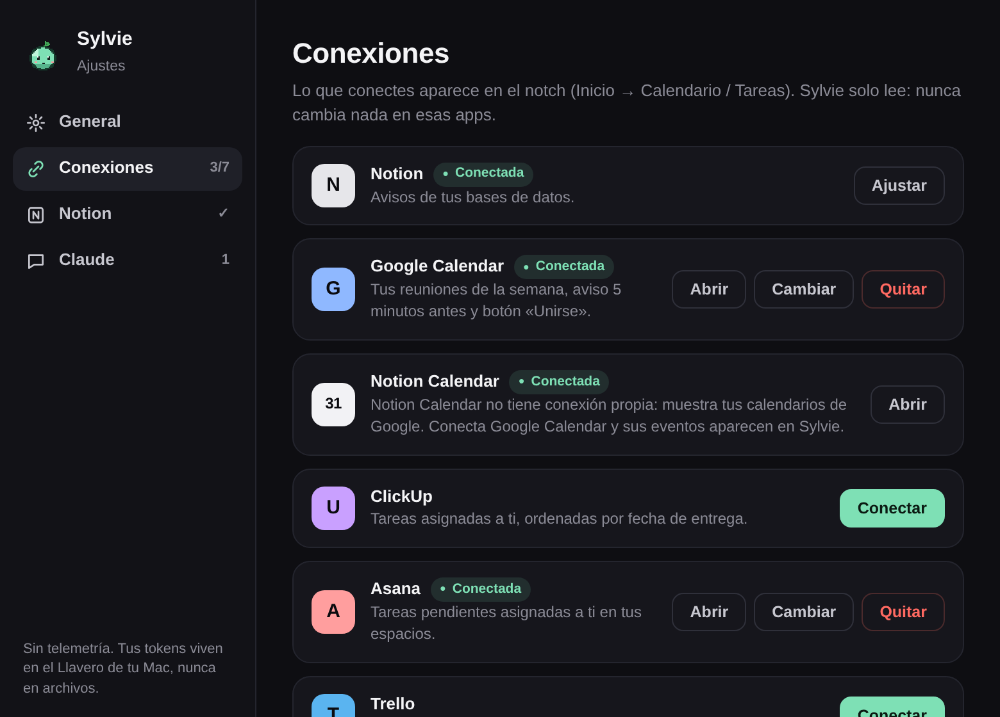

<div align="center">



<br>

[](https://github.com/gaboquirogaper/sylvie/releases/latest)
[](https://github.com/gaboquirogaper/sylvie/releases)
[](#%EF%B8%8F-instalar)
[](https://tauri.app)
<!-- DISCORD: cambia "#-comunidad" por tu enlace de invitación (https://discord.gg/xxxx) y "pronto" por "únete" -->
[](#-comunidad)

**Sylvie vive en el notch de tu MacBook** (o flota en una esquina si tu pantalla no tiene notch).<br>
Te avisa de lo que cambia en Notion, hace cosas por ti con Claude, controla tu música<br>
y te muestra tu agenda, sin abrir ninguna ventana.

### [⬇️ Descargar para Mac](https://github.com/gaboquirogaper/sylvie/releases/latest) &nbsp;·&nbsp; [⬇️ Descargar para Windows](https://github.com/gaboquirogaper/sylvie/releases/latest)



<sub>La semillita cambia de cara según lo que pasa: tranquila, feliz, pensando, de DJ… y duerme si dejas la compu.</sub>

</div>

---

## ✨ Qué hace

<table>
<tr>
<td width="50%" valign="top">

### 🎵 Tu música, en el notch
Spotify, Apple Music, YouTube y YouTube Music con **portada real**, barra para adelantar y botones. El corazón guarda la canción en tus favoritos.

</td>
<td width="50%"></td>
</tr>
<tr>
<td width="50%"></td>
<td width="50%" valign="top">

### 🤖 Pídele cosas a Claude
«Crea una tarjeta para el viernes», «¿qué reuniones tengo mañana?». Sylvie usa **Claude Code** con tu propio plan y te muestra cada paso. Puedes adjuntar archivos o texto largo.

</td>
</tr>
<tr>
<td width="50%" valign="top">

### 📅 Agenda y tareas
Tus reuniones de la semana con botón **«Unirse»** (Meet, Zoom, Teams) y un aviso 5 minutos antes. Tus tareas pendientes de ClickUp, Asana, Trello y Planner, con las vencidas en rojo.

</td>
<td width="50%"></td>
</tr>
<tr>
<td width="50%"></td>
<td width="50%" valign="top">

### 🌱 Notch o mascota flotante
¿Tu pantalla no tiene notch? Sylvie flota en una esquina y la mueves arrastrándola. Arrastra archivos sobre ella y **se los come** 🍽️ para mandarlos por AirDrop.

</td>
</tr>
</table>

<div align="center">


<sub>En reposo, Sylvie ocupa lo mismo que el notch. Los iconitos se encienden cuando una app tiene algo para ti.</sub>
</div>

## 🔌 Conexiones

| App | Qué muestra Sylvie | Cómo se conecta |
|---|---|---|
| **Notion** | Avisos de tus bases y pedidos con Claude | Token de integración |
| **Claude** | Pedidos en lenguaje normal | Claude Code (tu plan) |
| **Spotify · Apple Music** | Lo que suena, portada y controles | Automático |
| **YouTube · YouTube Music** | Lo que suena en Chrome, Brave, Edge o Safari | Automático |
| **Google Calendar · Notion Calendar** | Reuniones de la semana y «Unirse» | Dirección secreta iCal |
| **ClickUp · Asana · Trello** | Tareas pendientes asignadas a ti | Token personal |
| **Microsoft Planner** | Tareas de Microsoft 365 | Iniciar sesión con Microsoft |
| **Seed Studio** | Citas y asistente de IA | Próximamente |

Todo se configura desde **Ajustes**, con los pasos explicados para cada app.

<div align="center"></div>

## 🔒 Privacidad

- **Sin telemetría.** Sylvie no manda datos a ningún servidor propio.
- Solo habla con las apps que tú conectas, con Claude Code en tu compu y con los servicios de música para las portadas.
- Tus tokens se guardan en el **Llavero de macOS** (o el Administrador de credenciales de Windows), nunca en archivos.
- Las conexiones solo **leen**. Sylvie no cambia nada en tus apps, salvo cuando tú se lo pides a Claude o tocas el corazón.

## ⬇️ Instalar

**Mac** (macOS 12 o más nuevo)
1. Descarga el `.dmg` de la [última versión](https://github.com/gaboquirogaper/sylvie/releases/latest): `aarch64` para chip Apple (M1, M2, M3…) o `x64` para Intel.
2. Arrastra **Sylvie** a **Aplicaciones**.
3. La primera vez: clic derecho sobre Sylvie → **Abrir** → **Abrir**. (La app todavía no está firmada por Apple.)

**Windows 10 / 11** <sub>🚧 en desarrollo</sub>
1. Descarga el `…-setup.exe` de la [última versión](https://github.com/gaboquirogaper/sylvie/releases/latest).
2. Si Windows muestra un aviso azul: **Más información → Ejecutar de todas formas**.

> **Para los pedidos a Claude** necesitas [Claude Code](https://claude.com/claude-code) instalado y con tu sesión iniciada. El resto de Sylvie funciona sin él.

## 💬 Comunidad

<!-- DISCORD: cuando tengas el servidor, reemplaza la línea «El servidor de Discord llega pronto» por:
[](https://discord.gg/xxxx)
-->
**El servidor de Discord llega pronto** 🌱. Mientras tanto:

- ¿Algo no funciona? → [Cuéntanos el error](https://github.com/gaboquirogaper/sylvie/issues/new?template=error.yml)
- ¿Tienes una idea? → [Propón una función](https://github.com/gaboquirogaper/sylvie/issues/new?template=idea.yml)

## 🗺️ Hoja de ruta

- [x] Notch con estados (compacto, asomado, panel, avisos)
- [x] Notion, Claude, música con portada, AirDrop
- [x] Calendario, ClickUp, Asana, Trello, Planner
- [x] YouTube, corazón de Spotify, adjuntos para Claude
- [x] Mascota flotante para pantallas sin notch
- [ ] **Windows** con todas las funciones
- [ ] Atajo de teclado para abrir Sylvie
- [ ] Aprobar los permisos de Claude Code desde el notch
- [ ] Seed Studio

## 🛠️ Para desarrolladores

Hecho con [Tauri 2](https://tauri.app) (Rust + TypeScript, sin frameworks).

```bash
npm install
npm run tauri dev      # probar
npm run tauri build    # armar la app
```

| Carpeta | Qué hay |
|---|---|
| `src-tauri/src/` | Rust: ventana del notch, Notion, Claude Code, música, YouTube, calendario, integraciones, Llavero… (cada archivo explica lo que hace) |
| `src/` | La interfaz: `main.ts` (notch), `configuracion.ts` (Ajustes), `mascota.ts` (animaciones) |
| `src/assets/sylvie/` | Los sprites de la semillita, en tiras de 32×32 |
| `herramientas/` | Generador de sprites e ícono, diagnóstico de YouTube |

Para que Spotify y Microsoft Planner se conecten con un solo botón, pon los IDs públicos de tus apps en `src-tauri/src/claves_publicas.rs`.

Las versiones se publican solas: al subir una etiqueta `v0.x.y`, GitHub arma los instaladores de Mac y Windows (ver `.github/workflows/publicar.yml`).

<details>
<summary><b>🇺🇸 English</b></summary>

<br>

**Sylvie lives in your MacBook's notch** (or floats in a corner on screens without one). It shows Notion updates, runs requests through **Claude Code** with your own plan, controls Spotify, Apple Music and YouTube with real album art, and shows your calendar and tasks from Google Calendar, ClickUp, Asana, Trello and Microsoft Planner.

- No telemetry. Tokens are stored in the macOS Keychain or the Windows Credential Manager.
- Download the `.dmg` (Mac) or `-setup.exe` (Windows, in progress) from [Releases](https://github.com/gaboquirogaper/sylvie/releases/latest).
- First launch on Mac: right-click → **Open** (the app is not notarized yet).

The app's interface is in Spanish for now.

</details>

---

<div align="center">
<sub>Hecho con 🌱 por <a href="https://github.com/gaboquirogaper">Gabo</a>. La mascota, los iconitos y el diseño son originales.</sub>
</div>
